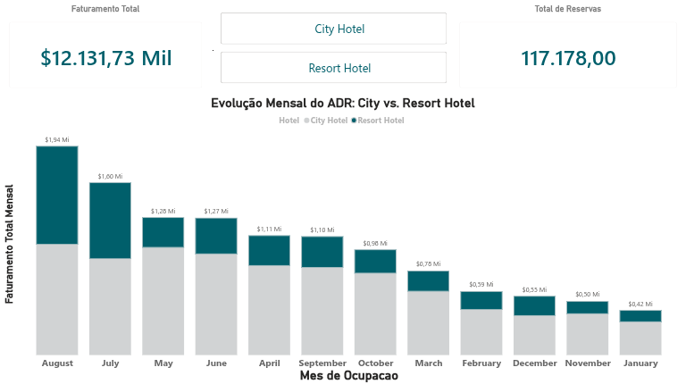

# 📊 Projeto: Análise de Consumo e Sazonalidade Hoteleira

## 🚀 Status: Fase de Visualização e Dashboards Concluída
Este projeto analisa os padrões de reservas e receitas de dois hotéis (City e Resort), cobrindo todo o ciclo de dados: desde a limpeza e EDA (Exploratory Data Analysis) em Python até a criação de dashboards executivos no Power BI.

---

## 🖥️ Dashboard Final (Power BI)

> **Destaque do Dashboard:** > - **Visualização:** Utilizei uma paleta **Azul Petróleo** para manter a sobriedade executiva e facilitar a leitura dos KPIs.
> - **Interatividade:** Implementação de filtros dinâmicos por tipo de hotel e gráficos de barras empilhadas para análise de mix de receita.
> - **UX Design:** Aplicação de hierarquia visual para destacar o Faturamento Total e o Volume de Reservas.

---

## 🧹 Processamento e Limpeza de Dados (Back-end)
Para garantir uma análise rigorosa e sem distorções, realizei as seguintes tarefas:

1.  **Filtragem de ADR:** Remoção de registros com tarifas incorretas (menores que 0 ou maiores que 1000).
2.  **Integridade dos Hóspedes:** Criação de coluna para soma total (adultos + crianças + bebês) e eliminação de registros com valor zero.
3.  **Métricas de Receita (BI):** Criação da coluna `df_revenue` (`adr` * `total_nights`), considerando apenas reservas com check-out concluído.

---

## 💡 Principais Insights e Conclusões

* **Perfil do Cliente:** Predomínio de casais (2 adultos) sem filhos (baseado na análise de quartis).
* **Sazonalidade Crítica:** A receita atinge o seu **pico absoluto em agosto**, sugerindo a necessidade de reforço de staff e gestão de inventário neste período.
* **Detecção de Outliers:** Identificação de reserva atípica (ITA) com ADR de $510, muito acima da média de $103,48.

---

## 🛠️ Tecnologias Utilizadas
* **Python:** Pandas, Seaborn e Matplotlib (Limpeza e EDA).
* **Power BI Service:** Construção de Dashboards interativos e modelagem de dados.
* **Linguagem DAX:** Para métricas calculadas de faturamento e volume.

---

## 📁 Como visualizar
1. O ficheiro original do Power BI está disponível como **`Relatorio_Performance_Hotelaria.pbix`**.
2. O notebook com a limpeza inicial está na pasta de scripts.
